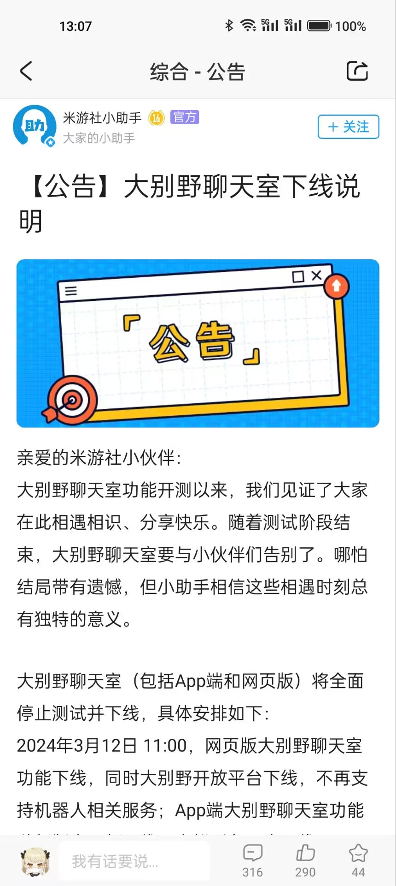

# Simple Robot 米游社组件

此为 [Simple Robot v3][simbot3] （以下简称为 `simbot3` ）
下基于simbot标准API对 [米游社 API](https://webstatic.mihoyo.com/vila/bot/doc/) 的组件支持。

[simbot3]: https://github.com/simple-robot/simpler-robot

## R.I.P

> [!CAUTION]
> 米游社大别野已经走向生命尽头。
> 
> 公告原帖: [【公告】大别野聊天室下线说明](https://www.miyoushe.com/dby/article/49502845)



## 文档

了解**simbot3**: [simbot3官网](https://simbot.forte.love)

文档手册：https://simple-robot.github.io/simbot-component-miyoushe-villa/

## 风格预览

> [!note]
> 不论是 simbot API 本身还是其衍生项目（比如本项目）都会提供对 Java 的友好兼容。

### API

> [!note]
> API 模块基于 KMP 支持多平台，包括 JVM、JS（nodeJS）和 native。

[api模块](simbot-component-miyoushe-villa-api) 尽可能保证对API的定义与使用"原汁原味"，全面而不做过多封装，是一种 `low-level` 库。

以 "获取房间列表信息" 为例

```kotlin
// 准备一个请求API时需要填充到请求头中的信息
val token = MiyousheVillaApiToken(botId, botSecret, villaId)
// 准备一个 Ktor HttpClient
val client = HttpClient()
// 构建API，此API没有参数
val api = GetVillaGroupRoomListApi.create()

// 请求API，得到预期类型的结果。
val data = api.requestData(client, token)

println(data)
```

### stdlib

> [!note]
> stdlib 模块基于 KMP 支持多平台，包括 JVM、JS（nodeJS）和 native。

[标准库模块](simbot-component-miyoushe-villa-stdlib) 基于 [api模块](simbot-component-miyoushe-villa-api)，
提供针对 `Bot` 相关的基本功能实现，主要包括建立连接、事件订阅以及基于 `Bot` 对 `api模块` 中请求API的方式的简化等。

#### 创建 Bot 、订阅事件

```kotlin
// bot 的一些信息，比如id等。
val ticket = Bot.Ticket(botId, botSecret)

// 构建一个 bot，并可选的修改一些配置
val bot = BotFactory.create(ticket) {
    loginVillaId = villaId
}

// 注册一个监听任何类型事件的处理器
bot.registerProcessor { source -> // this: Event<EventExtendData>
    println("event: $this")
}

// 注册一个只监听消息事件 SendMessage 的处理器
bot.processEvent<SendMessage> { source -> // this: Event<SendMessage>
    val content = extendData.content
    // 可以使用 bot.apiDecoder 解析 content 的 JSON 为封装好的对应类型。
    val msgContentInfo = bot.apiDecoder.decodeFromString<MsgContentInfo<TextMsgContent>>(content)
    println(msgContentInfo)

    if ("stop" in msgContentInfo.content.text) {
        // 在事件中关闭 bot
        bot.cancel()
    }

    // 或者使用API发起请求之类的。
}

// 启动bot
bot.start()
// 挂起bot，直到它被关闭
bot.join()
```

#### 使用 Bot 请求API

以 "获取房间列表信息" 为例

```kotlin
// 假设你构建了一个 Bot
val bot = ...
// 准备一个API
val api = GetVillaGroupRoomListApi.create()
// 直接通过 bot 请求API，并给它一个当前的大别野id
val data = api.requestDataBy(bot, villaId)

println(data)
```

### core

> [!warning]
> TODO 尚未完成。可参考 [simbot3 走马观花](https://simbot.forte.love/docs/take-a-look/listen-overview) 中的API风格。

## License

`simbot-component-miyoushe` 使用 `LGPLv3` 许可证开源。

```
This program is free software: you can redistribute it and/or modify it under the terms of 
the GNU Lesser General Public License as published by the Free Software Foundation, either 
version 3 of the License, or (at your option) any later version.

This program is distributed in the hope that it will be useful, but WITHOUT ANY WARRANTY;
without even the implied warranty of MERCHANTABILITY or FITNESS FOR A PARTICULAR PURPOSE. 
See the GNU Lesser General Public License for more details.

You should have received a copy of the GNU Lesser General Public License along with this 
program. If not, see <https://www.gnu.org/licenses/>.

